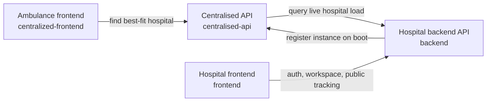

# HackAUBG 2026 | 404 Team Name Not Found

Emergency care works best when information moves faster than panic. This project is our HackAUBG prototype for calmer emergency coordination: an ambulance can discover a suitable participating hospital, hospital staff can manage live intake and internal flow, and patients can follow their active visit without calling the front desk for every update.

The platform is built to be self-hosted by hospitals. For demo purposes, we have also deployed a hosted version of every major surface.

## Team

Participants, ordered alphabetically by first name:

- Kristi-Anna Shalamanova
- Krasimir Prodanov
- Nikola Andreev
- Nikola Velikov
- Spasimir Pavlov
- Vladimir Pasev

## What Lives In This Repository

This repository contains four independent applications that work together at runtime. It is a shared workspace, not a package-sharing monorepo.

| Path | Role | Main stack | Talks to |
| --- | --- | --- | --- |
| `backend` | Hospital backend API for staff workflows, patient state, admin, archives, and realtime events | NestJS, Prisma, SQLite, Redis | `frontend`, `centralised-api` |
| `frontend` | Hospital web client for registry, nurse, doctor, admin, and public patient tracking | React, Vite, TypeScript | `backend` |
| `centralised-api` | Dispatch registry service that stores hospital instances and looks up nearby hospitals | NestJS, filesystem CSV store | `backend`, `centralized-frontend` |
| `centralized-frontend` | Ambulance-facing map UI that geolocates the device and asks the central service for a hospital match | React, Vite, Leaflet | `centralised-api` |

`centralised-api` and `centralized-frontend` intentionally use different spellings in directory names. They are the paired dispatch-side stack.

## System Architecture



## Deployment Links

### Self-hosting direction

The intended production model is self-hosted deployment for hospitals. Each hospital runs its own hospital backend and hospital frontend, exposes its own API base URL, and registers itself with the central dispatch service.

### Demo deployment

| Surface | URL |
| --- | --- |
| Hospital frontend | [frontend-production-438f.up.railway.app](https://frontend-production-438f.up.railway.app) |
| Ambulance frontend | [centralized-frontend-production.up.railway.app](https://centralized-frontend-production.up.railway.app) |
| Hospital backend API | [backend-production-785e.up.railway.app](https://backend-production-785e.up.railway.app) |
| Swagger | [backend-production-785e.up.railway.app/api](https://backend-production-785e.up.railway.app/api) |
| Centralised API | [centralised-api-production.up.railway.app](https://centralised-api-production.up.railway.app) |
| Health check | [backend-production-785e.up.railway.app/health](https://backend-production-785e.up.railway.app/health) |
| Example best-fit lookup | [centralised-api-production.up.railway.app/api/find-best-fit-hospital?lat=42.02352916358495&lng=23.089823070487814](https://centralised-api-production.up.railway.app/api/find-best-fit-hospital?lat=42.02352916358495&lng=23.089823070487814) |

## How The Apps Work Together

1. The hospital backend boots, reads its coordinates, and registers itself with the centralised API.
2. The centralised API stores hospital instance records and can ask each registered hospital for its current load.
3. The ambulance frontend gets the ambulance location from the browser, calls the centralised API, and receives a hospital match.
4. The hospital frontend signs staff in against the backend, loads workspace state, and stays fresh through server-sent events.
5. Public patient tracking is served by the hospital frontend and hospital backend directly, not by the centralised API.

## Local Development

### Prerequisites

- Node.js 20+
- npm
- Redis available locally, by default at `redis://127.0.0.1:6379`
- Four free ports if you run the full stack locally:
  - `3000` for `backend`
  - `3001` for `centralised-api`
  - `4173` for `frontend`
  - `4174` for `centralized-frontend`

### Recommended startup order

1. Start Redis.
2. Start `centralised-api` so the hospital can register itself.
3. Start `backend`, run Prisma migrations, and seed demo data.
4. Start `frontend`.
5. Start `centralized-frontend`.

### Quick start

#### 1. Centralised API

```bash
cd centralised-api
npm install
cp .env.example .env
npm run start:dev
```

#### 2. Hospital backend

```bash
cd backend
npm install
cp .env.example .env
npx prisma migrate dev
npm run seed
npm run start:dev
```

#### 3. Hospital frontend

```bash
cd frontend
npm install
cp .env.example .env
npm run dev
```

#### 4. Ambulance frontend

```bash
cd centralized-frontend
npm install
cp .env.example .env
npm run dev
```

## Testing And Validation Status

The commands below were re-run against the current repository state and are documented honestly rather than presented as fully green.

| Project | Command | Current status | Notes |
| --- | --- | --- | --- |
| `backend` | `npm test` | Passes | 3 suites, 17 tests passing |
| `backend` | `npm run test:e2e` | Fails | Jest cannot resolve the `src/patient/patient.service` import used by `src/controller/decentralized.controller.ts` |
| `frontend` | `npm test` | Passes | 9 test files, 17 tests passing |
| `centralised-api` | `npm test` | Fails | No unit specs are currently discovered by Jest |
| `centralised-api` | `npm run test:e2e` | Fails | The e2e test still expects `GET /` to return `Hello World!`, but that route no longer exists |
| `centralized-frontend` | `npm run build` | Passes | Production build completes successfully |

## Where To Read Next

- [`backend/README.md`](backend/README.md) for the hospital API, persistence model, workflow engine, Swagger, and archive behavior.
- [`frontend/README.md`](frontend/README.md) for staff routes, auth behavior, public patient tracking, and frontend folder relationships.
- [`centralised-api/README.md`](centralised-api/README.md) for hospital registration and dispatch lookup behavior.
- [`centralized-frontend/README.md`](centralized-frontend/README.md) for the ambulance map flow and geolocation-based lookup UI.
